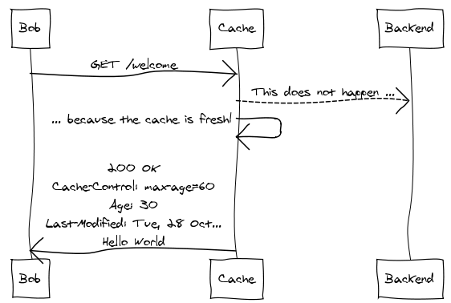
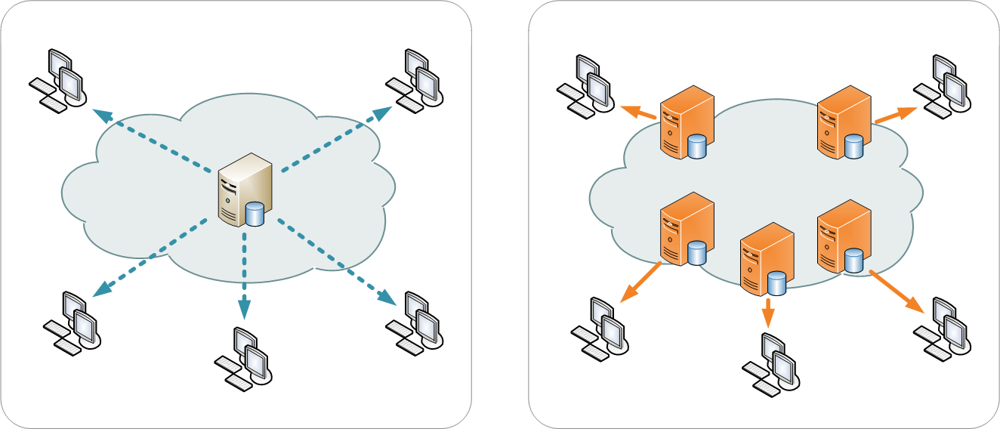

## HTTP Cache

### Vefforritun

### Ólafur Sverrir Kjartansson, [osk@hi.is](mailto:osk@hi.is)

---

## Caching & HTTP

HTTP skilgreinir Þrjár leiðir til að cachea gögn:

1. Ferskleiki – tími sem gögn eru „fersk“ og ekki þarf að sækja aftur á vefþjón, með [`Cache-Control` header](https://developer.mozilla.org/en-US/docs/Web/HTTP/Caching#the_cache-control_header)
2. Staðfesting – getum fengið staðfestingu hvort gögn séu enn í lagi t.d. með `If-Last-Modified` haus og `ETag` haus
3. Ógilding – ef við breytum gögnum (`POST, PUT, DELETE`) þá er cache hreinsað

***

## Hvar er cacheað?

* Vafrar – Til að bæta upplifun eru hlutir sem má geyma, geymdir í vafra cache
* Proxy cache – Svipað og í vöfrum, nema á stærri skala, t.d. hjá fyrirtæki eða ISP
* Gateway cache (eða reverse proxy cache) – Yfirleitt sett upp fyrir framan bakenda til að draga úr þörf á að sækja sama efnið oft

***

***

***

***

## CDN

* Content Delivery Network
* Sér um að dreifa efni um heiminn og gera aðgengilegra hraðar
* Cachear efni á endanóðum og notar allskonar trikk til að auka hraða
* [Cloudflare](https://www.cloudflare.com/) er dæmi um stóra CDN þjónustu með ókeypis byrjunarplan

***

