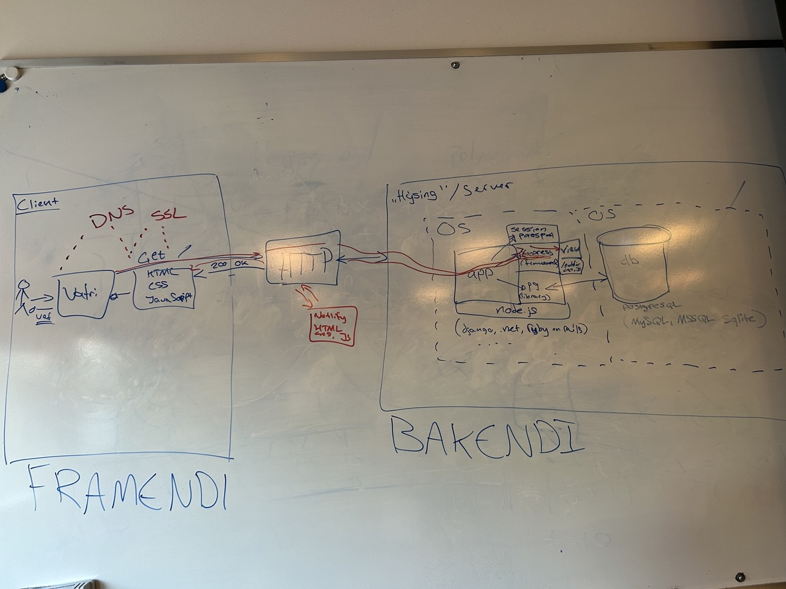

# Vika 5, 5.–11. febrúar 2024

## Fyrirlestrar

- [Fyrirlestur 5: áframhald á verkefni 2](https://youtu.be/iKcDe3YtmjQ)

Í fyrrihluta var umræða um bakenda og framenda sem endaði á þessari rosalegu mynd:

 ([myndir af hverjum hluta í möppu](img/)).

## Námsefni

- [postgres](../namsefni/11.postgres/)
- [Heroku](../namsefni/12.heroku/)

### Aukaefni

Ekki er krafa um að nota Heroku þar sem nú verður að greiða fyrir hýsinguna. Í staðinn er hægt að nota [Render](https://render.com/) eða [Railway](https://railway.app/). Árið 2023 var farið yfir uppsetningu á verkefnum á báðum stöðum:

- [Uppsetning á verkefni á Render](https://youtu.be/cOM09Lu4IxI?t=249)
- [Uppsetning á verkefni á Railway](https://youtu.be/cOM09Lu4IxI?t=1359)

## Verkefni

- [ ] Setja upp postgres á vél
- [ ] Skoða sýnilausn á [verkefni 2 frá 2022](https://github.com/vefforritun/vef2-2022-v2-synilausn) og [verkefni 2 frá 2023](https://github.com/vefforritun/vef2-2023-v2-synilausn)
- [ ] Halda áfram með verkefni 2
- [ ] Skrá sig á [Render](https://render.com/) eða [Railway](https://railway.app/) og setja upp verkefni þar
